# Architecture

How the system is put together, and why. Read
[§ End-to-end walkthrough](#end-to-end-walkthrough) first if you are new to
the codebase.

---

## 1. System overview

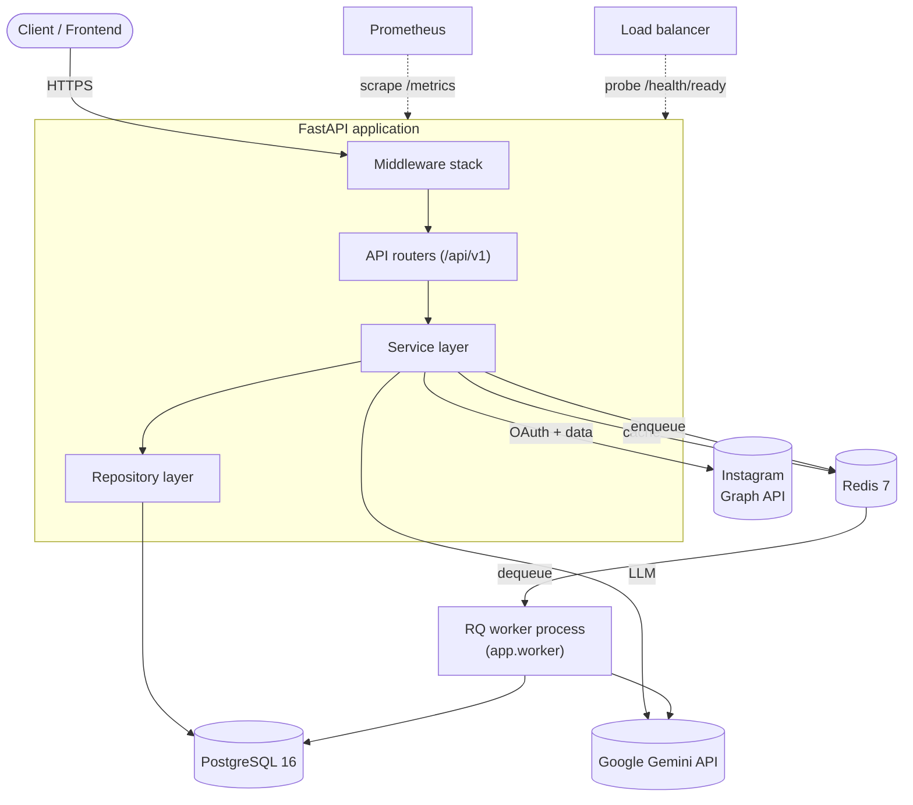

The application process and the worker process run the **same image** with
different commands. The worker has no HTTP surface; it exists so that
report generation can run without holding a request open.

---

## 2. Layered architecture

The core rule, enforced by convention and covered by tests:

> **Route → Service → Repository → SQLAlchemy → PostgreSQL**

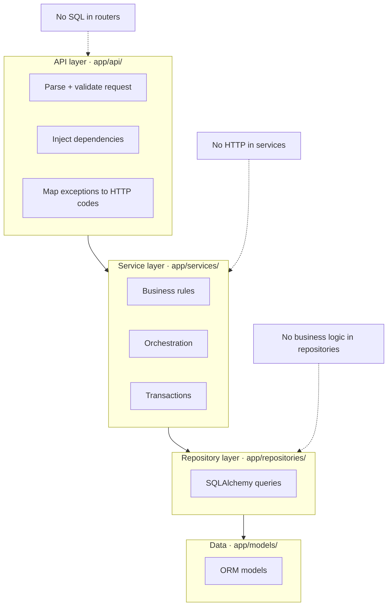

| Layer | Does | Never does |
| --- | --- | --- |
| **API** (`app/api/`) | Validates input, injects dependencies, translates service exceptions into status codes | Business logic, database access |
| **Service** (`app/services/`) | Business rules, orchestration, commits transactions, calls external APIs | Touch `Request`/`Response`, raise `HTTPException`, build SQL |
| **Repository** (`app/repositories/`) | Every SQLAlchemy query in the codebase | Business decisions, commits |
| **Model** (`app/models/`) | Table definitions | Anything else |

Supporting packages:

| Package | Role |
| --- | --- |
| `app/core/` | Settings, logging, middleware, rate limiter, exception handlers |
| `app/dependencies/` | FastAPI DI providers — the wiring between layers |
| `app/integrations/` | Outbound clients: Graph API, LangGraph/Gemini, Redis, task queue |
| `app/schemas/` | Pydantic request/response contracts |
| `app/utils/` | Pure functions — hashing, JWT, encryption, cache, analytics maths |
| `app/workers/` | Background job functions |

**Why services never raise `HTTPException`:** the same service is called from
HTTP routers, from AI tools, and from background jobs. A service that raises
HTTP errors would force a web framework into contexts that have no request.
Instead each service defines its own exception hierarchy, and the router maps
it — see `_handle_service_error` in `app/api/v1/endpoints/instagram.py`.

### Dependency injection

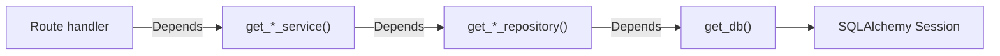

One session per request, closed in a `finally`. Because the whole chain is
`Depends()`-based, tests swap the database by overriding a single provider
(`app.dependency_overrides[get_db]`).

---

## 3. Database design

Five tables. Full column reference in [DATABASE.md](DATABASE.md).

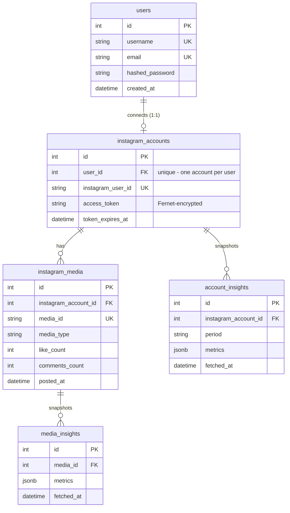

Three design decisions worth knowing:

1. **Metrics are JSONB, not columns.** Meta adds, renames, and retires
   insight metrics between API versions. Storing `{metric_name: value}`
   means a new metric is a code change, not a migration.
2. **Insights are append-only snapshots**, never updated in place. That is
   what makes trends and follower growth computable — history is the data.
   "Current" always means the newest row for that entity.
3. **`account_insights.period` doubles as a discriminator.** `"day"` rows
   hold Graph API account insights; `"profile"` rows hold follower/media
   count snapshots written on every profile refresh. Reusing one table
   avoided a near-identical second one.

---

## 4. Authentication flow

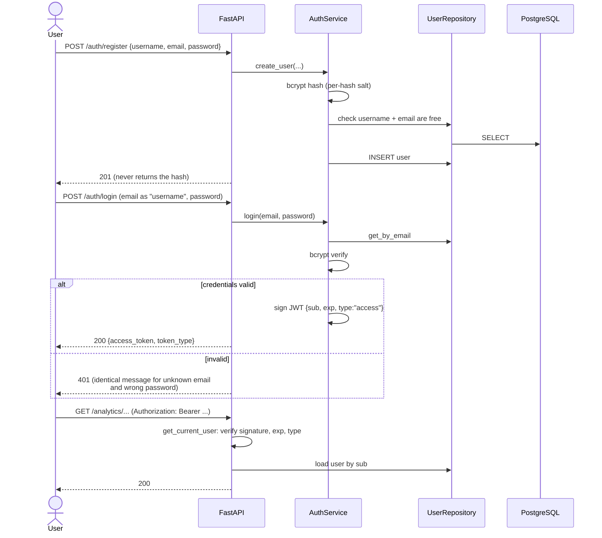

**The `type` claim matters.** Every token this app issues carries one, and
every decoder verifies it. Without that check, any token signed with
`JWT_SECRET_KEY` would be interchangeable — including the Instagram OAuth
*state* token, which travels in a URL and therefore reaches browser history
and the `Referer` header sent to `facebook.com`. That was a real flaw, found
and fixed in the Milestone 9 review
([CODE_REVIEW.md § SEC-2](CODE_REVIEW.md#1-security-findings)).

Login and registration are rate limited (`RATE_LIMIT_AUTH`, 5/min) to blunt
brute force.

---

## 5. Instagram OAuth and Graph API integration

Meta does not expose Instagram Business data directly. The path runs through
Facebook Login for Business: a user's Facebook Page is what links to their
Instagram Business account.

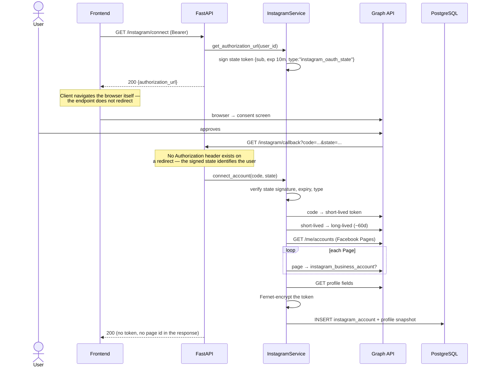

Afterwards, `/instagram/media` and `/instagram/insights` fetch and persist
content and metrics using the stored token.

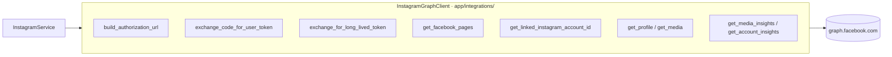

The client is the only place that knows Graph API URLs, field lists, and
response shapes; it raises `InstagramAPIError`, which the service translates
into domain errors (`InstagramTokenExpiredError` for 401/403,
`InstagramOAuthError` otherwise). Adding a Graph API call means adding a
method here, not new URL-building in a service.

**Token security.** Access tokens are Fernet-encrypted before storage,
excluded from every response schema, and never interpolated into error
messages. Expiry is checked before use, with a clear "reconnect your account"
error rather than a failed upstream call.

---

## 6. Analytics pipeline

Ingestion and analysis are deliberately separate. Nothing in the analytics
layer calls the Graph API — it reads only what was already stored, so a
dashboard load is fast and cannot exhaust Meta rate limits.

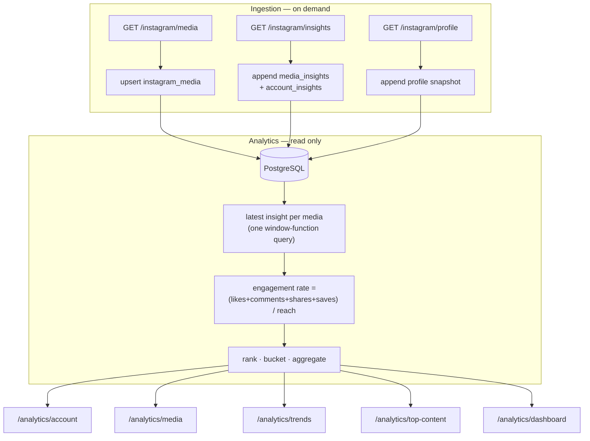

**Engagement rate** is `(likes + comments + shares + saves) / reach × 100`,
normalized by reach rather than followers. A consequence worth internalizing:
a small post with high engagement can outrank a viral one. That is intended —
it measures how compelling content was to the people who saw it.

**Avoiding N+1.** `get_latest_by_media_ids` fetches the newest insight for
every media item in a single `ROW_NUMBER()` query rather than one query per
post.

**Dashboard sharing.** `get_dashboard` resolves the account once and computes
media analytics once, passing both into all three sections. Calling the three
public methods instead would repeat that work three times — measured at 13
queries versus 7.

---

## 7. AI agent workflow (LangGraph)

`POST /ai/chat` runs a tool-calling loop. The model decides *which* analytics
to fetch; it never decides *whose*.

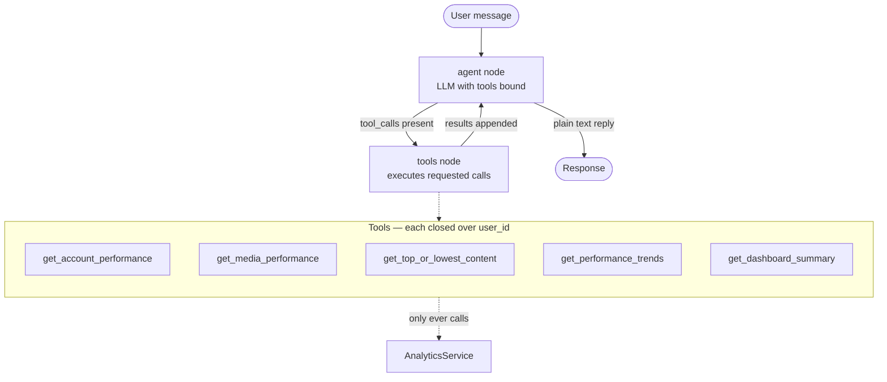

The graph is built in `app/integrations/ai_agent.py` from `StateGraph`,
`ToolNode`, and `tools_condition`; `AI_RECURSION_LIMIT` caps the loop.

**The security property.** `build_tools(analytics_service, user_id)` returns
closures. `user_id` is captured lexically, so it is *structurally absent*
from every tool's JSON schema — the model has no field in which to place a
different user. A prompt-injected `user_id` argument is dropped by the schema
binding before execution. This is asserted by tests at both the tool level
and over HTTP.

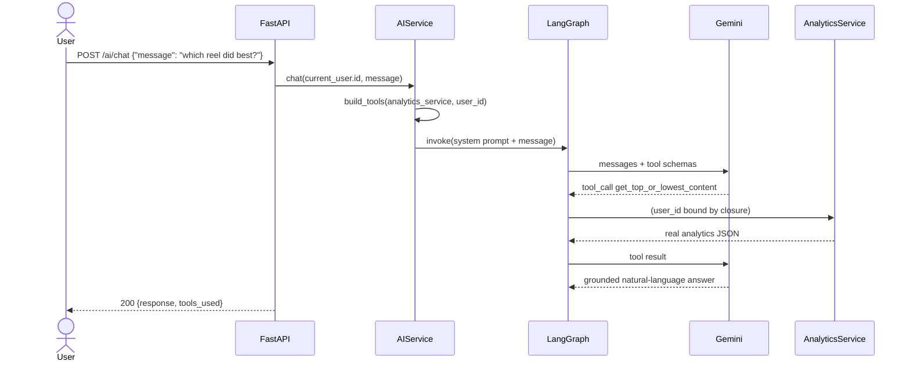

---

## 8. Insights, recommendations, and reports

These differ from chat: the required data is known in advance, so there is no
decision for an agent to make. Each endpoint gathers analytics
deterministically, then makes **one** structured-output LLM call.

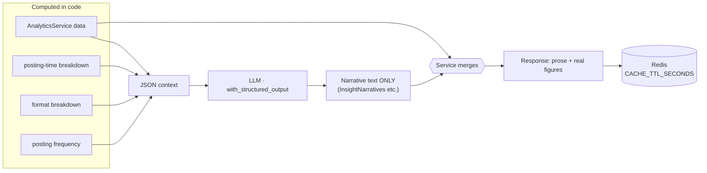

### Grounding: how AI output stays truthful

The schema handed to the model contains **only prose fields**. It has no
field for `followers_count`, no field for `top_performing_content`. Those are
attached afterwards by the service, straight from `AnalyticsService`. A
hallucinated number has nowhere to go.

This is verified rather than asserted: in the test suite the stub model
returns fixed prose containing no digits, yet every numeric field in the
response still matches the seeded database exactly.

Caching is per user and per parameter set. A cache miss costs one LLM call; a
hit costs none. If Redis is unavailable the cache **fails open** — the
request regenerates rather than failing.

### Credential resolution

Every AI code path obtains its Gemini key from a single service,
`AICredentialService.resolve_api_key(user_id)`:

1. the user's own stored key, Fernet-decrypted
2. `settings.GOOGLE_API_KEY`, as a development fallback
3. otherwise `AINotConfiguredError`, which routers map to `503`

It lives in one service rather than in the routers for three reasons. The
rule is business logic, so a router applying it would violate the layering.
`app/workers/jobs.py` has no router at all and would need a second copy.
And a security-sensitive precedence rule that exists in four places is one
that will eventually disagree with itself.

`AIService`, `InsightsService`, `RecommendationService` and `ReportService`
each take it as a constructor dependency, exactly as they take
`AnalyticsService` — no new injection pattern was invented for it.

A stored key that fails to decrypt raises rather than falling back to the
server key. Silently using a different account's quota because
`TOKEN_ENCRYPTION_KEY` was rotated is worse than a clear error the user can
fix by re-entering their key.

The cache is safe under this scheme without any extra work: its keys are
already user-scoped (`insights:{user_id}:{days}`), so a result generated with
one user's key can never be served to another.

---

## 9. Background jobs

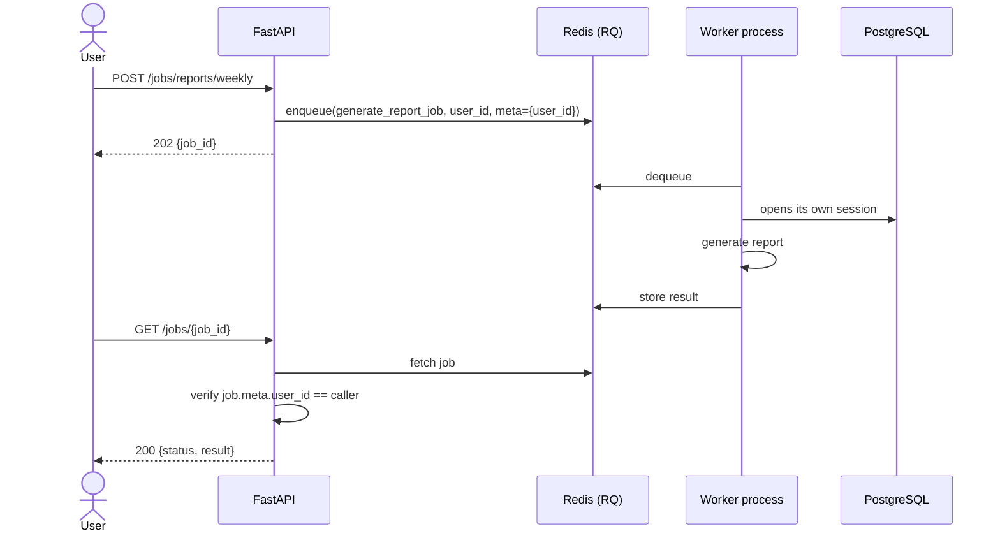

The job builds its own session and service graph rather than using FastAPI
dependency injection — a worker process has no request to inject from.
Ownership is recorded in job metadata and checked on read, so a leaked job ID
cannot expose another user's analytics.

---

## 10. Cross-cutting concerns

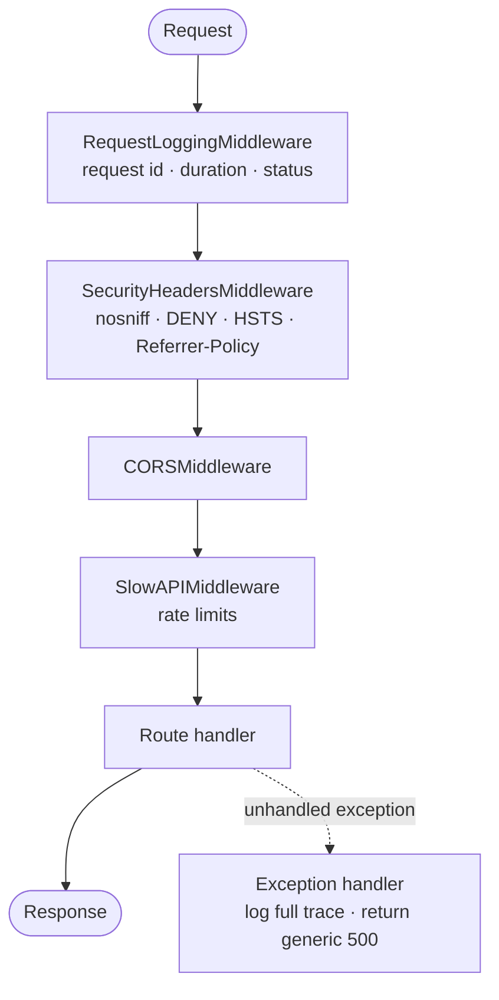

Middleware is registered in reverse (last added runs outermost); the order
above is the effective one. Request logging wraps everything so it records
the full duration including rate-limit rejections.

**Configuration** is a single validated Pydantic `Settings` object. When
`ENVIRONMENT=production` it refuses to start with `DEBUG=true`, a short
`JWT_SECRET_KEY`, or wildcard CORS — misconfiguration fails loudly at boot
rather than silently at runtime.

**Failure isolation** is deliberate: Redis is used for caching and jobs, but
losing it degrades rather than breaks. Cache reads fall through to
regeneration, and rate limiting is intentionally in-process precisely because
the library used does not fail open on storage loss
([DEPLOYMENT.md § Rate limiting](DEPLOYMENT.md#6-rate-limiting)).

---

## End-to-end walkthrough

Following `GET /api/v1/analytics/dashboard` all the way down:

1. **Middleware** — a request ID is generated; security headers and CORS are
   applied; the rate limiter checks the caller's IP bucket.
2. **Routing** — FastAPI matches `app/api/v1/endpoints/analytics.py`.
3. **Dependencies resolve**, innermost first: `get_db()` opens a session →
   four repositories are constructed on it → `get_analytics_service()`
   assembles them. Separately, `get_current_user()` validates the bearer
   token (signature, expiry, `type` claim) and loads the `User`.
4. **Handler** calls `analytics_service.get_dashboard(current_user.id)` and
   nothing else — no logic, no queries.
5. **Service** resolves the connected account (404 if none), then computes
   media analytics **once** and shares it across the account, top-content,
   and trend sections.
6. **Repositories** issue the SQL, including the single window-function query
   that fetches the latest insight per media item.
7. **Calculation utilities** (`app/utils/analytics_calculations.py`) do the
   arithmetic as pure functions — no I/O, exhaustively unit tested.
8. **Response** is validated against `DashboardResponse`; FastAPI serializes
   it.
9. **Unwinding** — the session closes in `get_db`'s `finally`; the logging
   middleware emits one structured line with status and duration; the metrics
   instrumentation records the observation.

The other flows in brief:

| Flow | Path |
| --- | --- |
| **Authentication** | `/auth/register` hashes and stores → `/auth/login` verifies and signs a typed JWT → `get_current_user` validates it on every protected route ([§4](#4-authentication-flow)) |
| **Instagram OAuth** | `/instagram/connect` mints a signed state → Meta consent → `/instagram/callback` exchanges the code, discovers the account, encrypts and stores the token ([§5](#5-instagram-oauth-and-graph-api-integration)) |
| **Analytics** | Ingestion writes append-only snapshots; the analytics layer reads them and derives rates, rankings, and trends ([§6](#6-analytics-pipeline)) |
| **AI agent** | A LangGraph loop picks tools; the tools query `AnalyticsService` with the caller's ID bound by closure ([§7](#7-ai-agent-workflow-langgraph)) |
| **Recommendations** | Deterministic breakdowns computed in code, narrated by one structured LLM call, merged with real figures by the service ([§8](#8-insights-recommendations-and-reports)) |
