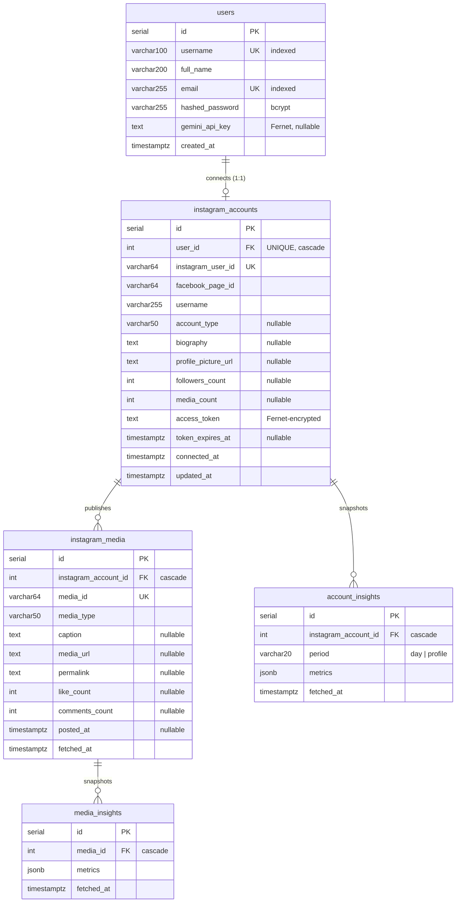
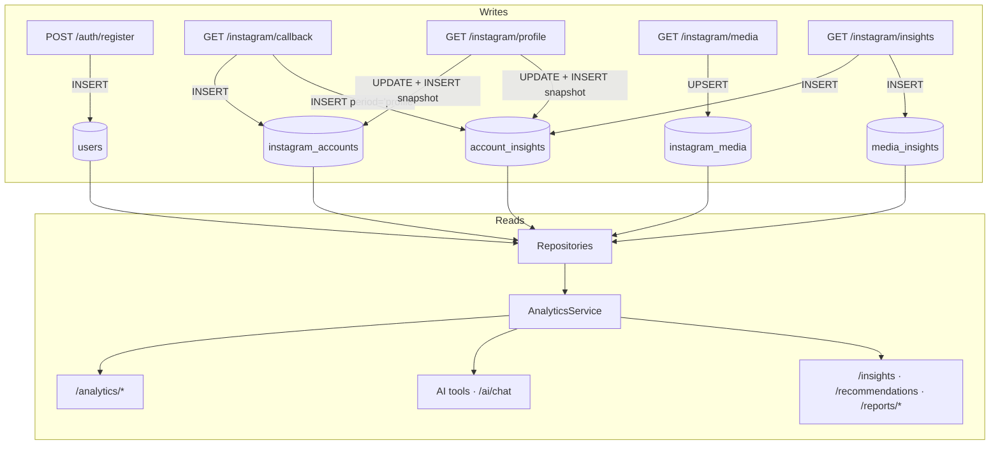

# Database

PostgreSQL 16, accessed through SQLAlchemy 2.0 with Alembic migrations.
Five tables.

---

## Entity relationships



Every foreign key is `ON DELETE CASCADE`, so disconnecting an Instagram
account removes its media and insights, and deleting a user removes
everything below them.

---

## Design decisions

### 1. Metrics are JSONB, not columns

`account_insights.metrics` and `media_insights.metrics` hold
`{metric_name: value}` rather than fixed columns.

Meta adds, renames, and retires insight metrics between Graph API versions.
With JSONB, supporting a new metric is a code change; with columns it would
be a migration every time Meta shifts. The trade-off — no column-level type
checking — is acceptable because these values are already untyped at the
source.

### 2. Insights are append-only snapshots

Insight rows are **never updated**. Every fetch inserts a new row with a
fresh `fetched_at`.

This is what makes trends and follower growth computable at all: history *is*
the data. "Current" always means the newest row for that entity, which is why
`media_insights` has a non-unique index on `media_id` — many rows per item is
the expected shape.

### 3. `account_insights.period` is a discriminator

| `period` | Written by | Contains |
| --- | --- | --- |
| `"day"` | `GET /instagram/insights` | Graph API account metrics — `reach`, `impressions`, `profile_views`, `accounts_engaged` |
| `"profile"` | `connect_account` and `GET /instagram/profile` | `followers_count`, `media_count` — the history behind follower growth |

`"profile"` is not a real Graph API period. Reusing this table avoided a
near-identical second one for what is structurally the same thing: a
timestamped bag of metrics for an account.

### 4. One Instagram account per user

`instagram_accounts.user_id` is **unique**, making the relationship 1:1.
`instagram_user_id` is also unique, so the same Instagram account cannot be
claimed by two users. Supporting multiple accounts per user later means
dropping the `user_id` unique constraint and adding an account selector to
the API.

### 5. Tokens are encrypted at rest

`access_token` holds a Fernet ciphertext, not the raw token. It is excluded
from every response schema. See
[ARCHITECTURE.md § Instagram integration](ARCHITECTURE.md#5-instagram-oauth-and-graph-api-integration).

---

## Indexes

| Index | Table | Columns | Unique | Why |
| --- | --- | --- | --- | --- |
| `ix_users_email` | `users` | `email` | ✅ | Login looks up by email on every authentication |
| `ix_users_username` | `users` | `username` | ✅ | Enforces uniqueness, used during registration |
| `ix_instagram_accounts_user_id` | `instagram_accounts` | `user_id` | ✅ | Every authenticated request resolves the caller's account; also enforces 1:1 |
| `ix_instagram_accounts_instagram_user_id` | `instagram_accounts` | `instagram_user_id` | ✅ | Stops one Instagram account being connected twice |
| `ix_instagram_media_instagram_account_id` | `instagram_media` | `instagram_account_id` | ❌ | Every analytics query lists an account's media |
| `ix_instagram_media_media_id` | `instagram_media` | `media_id` | ✅ | Upsert lookup during ingestion |
| `ix_media_insights_media_id` | `media_insights` | `media_id` | ❌ | Supports the "latest insight per media" window query |
| `ix_account_insights_instagram_account_id` | `account_insights` | `instagram_account_id` | ❌ | Trend and growth queries filter by account |

### Query worth knowing about

`MediaInsightRepository.get_latest_by_media_ids` fetches the newest insight
for *many* media items in **one** statement using `ROW_NUMBER()`, instead of
one query per post:

```sql
SELECT * FROM (
  SELECT mi.*,
         ROW_NUMBER() OVER (PARTITION BY media_id ORDER BY fetched_at DESC) AS rn
  FROM media_insights mi
  WHERE media_id IN (...)
) ranked
WHERE ranked.rn = 1;
```

A window function was chosen over Postgres's `DISTINCT ON` so the same code
runs on SQLite, which is what the test suite uses.

---

## Migrations

Five migrations, applied in order:

```
<base>
  └─ fd4ce6257d73  create users table
       └─ 7baedb55cfeb  add auth fields to users        (email, hashed_password)
            └─ 8adb28f8f995  add instagram integration tables
                 └─ 4f946de6dbf1  add engagement fields  (like_count, comments_count)
                      └─ c3a71f4b28de  add gemini api key to users              [head]
```

### Commands

Apply everything (this is what the Docker entrypoint runs on startup):

```bash
alembic upgrade head
```

Check the current revision:

```bash
alembic current
```

View history:

```bash
alembic history
```

Roll back one migration:

```bash
alembic downgrade -1
```

Preview SQL without touching the database — useful for reviewing a migration
before it runs in production:

```bash
alembic upgrade head --sql
```

### Creating a migration

Autogenerate from model changes:

```bash
alembic revision --autogenerate -m "add x to y"
```

> Autogeneration needs a reachable database. Without one, use
> `alembic revision -m "..."` to get an empty file and write `upgrade()` and
> `downgrade()` by hand — all four existing migrations were written this way.

**Always review the generated file.** Autogenerate misses table/column
renames (it emits a drop plus an add, losing data), server defaults, and
`ON DELETE` behavior.

Rules for this project:

1. New models must be imported in `app/models/__init__.py`, or Alembic will
   not see them.
2. Write a real `downgrade()`. Every existing migration has one.
3. Adding a `NOT NULL` column to a populated table needs a default or a
   three-step migration (add nullable → backfill → set not-null).
4. Verify with `alembic upgrade head --sql` before deploying.

---

## Data flow



Two properties fall out of this:

- **All writes are ingestion.** Analytics, AI, and reports are pure readers —
  no request to `/analytics/*` or `/insights` ever writes to the database.
- **Trends need history.** Follower growth requires two `"profile"` snapshots
  in the window, so a freshly connected account correctly reports
  `follower_growth: null` until `/instagram/profile` has been called at least
  twice over time.

---

## Transactions and sessions

- One session per HTTP request, provided by `get_db()` and closed in a
  `finally`.
- Repositories `flush()` but do not `commit()` — services own transaction
  boundaries, so multi-step operations succeed or fail as a unit.
- On `IntegrityError` a service rolls back and raises a domain exception
  (e.g. `DuplicateEmailError`), which the router maps to `409`. A rejected
  registration leaves no partial row — covered by a test.
- Background jobs open their own session; a worker process has no request
  scope to borrow from.

### Connection pooling

Configured in `app/database/session.py` from environment variables:

| Setting | Default | Meaning |
| --- | --- | --- |
| `DATABASE_POOL_SIZE` | 5 | Persistent connections per process |
| `DATABASE_MAX_OVERFLOW` | 10 | Extra connections allowed under load |
| `DATABASE_POOL_RECYCLE_SECONDS` | 1800 | Recycle connections older than this |
| `pool_pre_ping` | always on | Validates a connection before use, so one dropped by the server surfaces as a reconnect rather than a query error |

With 4 Uvicorn workers and the defaults, peak connections are
`4 × (5 + 10) = 60` — keep that under Postgres's `max_connections` (100 by
default).

---

## Local inspection

```bash
docker compose exec postgres psql -U postgres -d instagram_ai
```

```sql
\dt                              -- list tables
\d+ instagram_accounts           -- describe a table
SELECT * FROM alembic_version;   -- current migration
```

Inspect a JSONB metrics blob:

```sql
SELECT period, metrics, fetched_at
FROM account_insights
ORDER BY fetched_at DESC
LIMIT 5;
```
