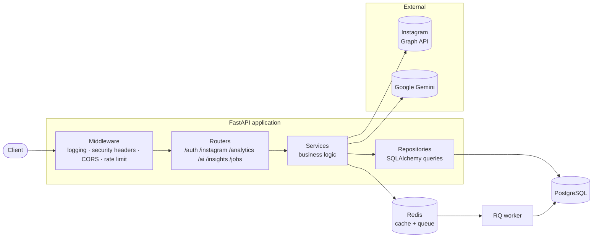

# Instalysis — AI Instagram Analytics Platform

A production-ready FastAPI backend and React frontend that connect an
Instagram Business or Creator account, turn its raw Graph API data into real
analytics, and let you interrogate those analytics in plain English through
an AI agent. Every user brings their own Google Gemini API key.

[](https://www.python.org/)
[](https://fastapi.tiangolo.com/)
[](https://react.dev/)
[](https://www.postgresql.org/)
[](Documents/TESTING.md)
[](LICENSE)

---

## What it does

Ask *"which reel performed best last month, and why?"* and get an answer
computed from your own stored analytics — not a guess.

The platform has four layers stacked on top of each other:

1. **Ingestion** — OAuth into Meta, pull profile, posts, reels, and insights
   from the Instagram Graph API, store them with tokens encrypted at rest.
2. **Analytics** — turn raw metrics into engagement rates, follower growth,
   trends over time, and best/worst performing content.
3. **AI agent** — a LangGraph tool-calling loop that answers natural-language
   questions by querying that analytics layer.
4. **Insights** — proactive, generated performance narratives, personalized
   recommendations, and weekly/monthly reports.

Every number the AI reports comes from the database. The model is asked to
write prose, never to produce figures — see
[Grounding](Documents/ARCHITECTURE.md#grounding-how-ai-output-stays-truthful).

---

## Features

**Accounts & auth**
- Registration and login with bcrypt-hashed passwords
- JWT access tokens with typed claims (an OAuth state token cannot be used as an API credential)
- Per-IP rate limiting, stricter on auth and AI endpoints

**Instagram integration**
- Facebook Login for Business OAuth flow with signed, expiring state
- Automatic discovery of the Instagram Business account behind a Facebook Page
- Long-lived token exchange, encrypted at rest with Fernet
- Fetch and store profile, posts, reels, and media/account insights

**Analytics engine**
- Reach-normalized engagement rate per post and account-wide
- Follower growth from historical snapshots
- Daily / weekly / monthly trends
- Top- and lowest-performing content, rankable by five metrics
- Single-call dashboard summary

**AI**
- Per-user Gemini API keys, Fernet-encrypted at rest and never returned by any endpoint
- `POST /ai/chat` — conversational analytics via a LangGraph agent with five tools
- `GET /insights` — five generated performance insights, each carrying its own supporting data
- `GET /recommendations` — posting times, formats, frequency, and content ideas derived from your own history
- `GET /reports/{weekly,monthly}` — full performance reports
- Responses cached per user in Redis, so repeat requests cost no LLM call

**Frontend** ([`frontend/`](frontend))
- Gated onboarding: bring your own Gemini key, connect Instagram, then the dashboard
- Overview, trends, posts and rankings, plus chat, insights, recommendations and reports
- Background report generation with job polling
- Swiss-minimal design system: strict grid, one accent, hairline rules, hand-rolled SVG charts

**Production**
- Structured JSON logging with per-request IDs
- Prometheus metrics at `/metrics`
- Liveness / readiness / health endpoints
- Background job queue (RQ) for long-running report generation
- Multi-stage Docker build, non-root runtime, production Compose stack
- Environment validation that refuses to boot an insecurely configured production instance

---

## Architecture at a glance



Requests flow strictly **Route → Service → Repository → SQLAlchemy →
PostgreSQL**. Routers never query the database; services never speak HTTP;
repositories never hold business logic. The AI agent is a client of the
service layer like any other caller — it has no database access of its own.

Full detail, including sequence diagrams for the auth, OAuth, analytics, and
AI flows, is in **[ARCHITECTURE.md](Documents/ARCHITECTURE.md)**.

---

## Technology stack

| Layer | Choice | Why |
| --- | --- | --- |
| API framework | FastAPI 0.141 | Async, typed, generates OpenAPI for free |
| Language | Python 3.12 | Modern typing syntax throughout |
| Database | PostgreSQL 16 | Relational core plus JSONB for evolving metric shapes |
| ORM | SQLAlchemy 2.0 | Modern `Mapped[]` declarative style |
| Migrations | Alembic | Versioned, reviewable schema changes |
| Validation | Pydantic v2 | Request/response schemas and settings validation |
| Auth | PyJWT + bcrypt | Standard, well-understood primitives |
| Encryption | cryptography (Fernet) | Authenticated symmetric encryption for stored tokens |
| AI orchestration | LangGraph 1.2 | Explicit, inspectable agent graph |
| LLM | Google Gemini (`gemini-2.5-flash` default) | Configurable via `GEMINI_MODEL`; free tier via Google AI Studio |
| Cache & queue | Redis 7 + RQ | One dependency serving both needs |
| Metrics | prometheus-fastapi-instrumentator | Standard scrape endpoint |
| Rate limiting | slowapi | Per-route limits |
| Testing | pytest + fakeredis | 339 tests, no external services required |
| Container | Docker multi-stage | Small, non-root production image |

---

## Folder structure

```
AI-Instalysis/
├── app/
│   ├── api/
│   │   ├── health.py              # /health, /health/ready, /health/live
│   │   └── v1/
│   │       ├── router.py          # aggregates all v1 routers
│   │       └── endpoints/         # auth, users, instagram, analytics, ai,
│   │                              # insights, jobs
│   ├── core/                      # settings, logging, middleware,
│   │                              # rate limiting, exception handlers
│   ├── database/                  # engine, session factory, declarative Base
│   ├── dependencies/              # FastAPI DI providers (db, auth, repos, services)
│   ├── integrations/              # outbound clients: Graph API, Gemini/LangGraph,
│   │                              # Redis, task queue
│   ├── models/                    # SQLAlchemy ORM models
│   ├── repositories/              # all database queries live here
│   ├── schemas/                   # Pydantic request/response models
│   ├── services/                  # business logic, prompts, AI tools
│   ├── utils/                     # pure helpers: hashing, JWT, encryption,
│   │                              # cache, analytics maths
│   ├── workers/                   # background job functions
│   ├── worker.py                  # RQ worker entrypoint
│   └── main.py                    # app assembly: middleware, handlers, routers
├── alembic/versions/              # 5 migrations
├── docker/entrypoint.sh           # migrate, then start
├── tests/
│   ├── unit/                      # 84 pure-logic tests
│   ├── integration/               # 88 service + repository tests
│   ├── api/                       # 167 full-stack HTTP tests
│   └── conftest.py                # all external boundaries stubbed here
├── frontend/                      # React + Vite client (see its own README)
│   └── src/
│       ├── api/                   # typed client, one module per backend router
│       ├── auth/                  # token storage, session expiry
│       ├── onboarding/            # AI-key + Instagram connection status
│       ├── routes/                # route guards
│       ├── pages/                 # login, onboarding, dashboards, AI, settings
│       ├── components/            # layout, UI primitives, SVG charts
│       └── styles/                # design tokens, base, grid
├── Dockerfile
├── docker-compose.yml             # local dev: Postgres + Redis only
├── docker-compose.prod.yml        # full stack: app + worker + Postgres + Redis
└── .env.example
```

Each folder's responsibility and the rules for adding to it are in
[DEVELOPER_GUIDE.md](Documents/DEVELOPER_GUIDE.md#folder-responsibilities).

---

## Quick start

```bash
git clone <your-repo-url> && cd AI-Instalysis
cp .env.example .env
```

The copied `.env` runs as-is locally — it ships with working development
secrets. (They are public, and the app refuses to start in production while
they are still in place.)

Start the dependencies:

```bash
docker compose up -d
```

```bash
python -m venv .venv && .venv/Scripts/activate && pip install -r requirements.txt
```

```bash
alembic upgrade head
```

```bash
uvicorn app.main:app --reload
```

The API is now at **http://localhost:8000/docs**. For the frontend, in a
second terminal:

```bash
cd frontend && npm install && npm run dev
```

Open **http://localhost:3000** and register. Onboarding asks for your own
Gemini API key ([get one free](https://aistudio.google.com/apikey)), then
your Instagram account.

Full instructions, including generating real secrets and the no-Docker path,
are in **[SETUP.md](Documents/SETUP.md)**.

> The frontend must run on port 3000 — `CORS_ALLOWED_ORIGINS` defaults to it,
> and `allow_credentials=True` means a wildcard origin is not permitted.
>
> Instagram needs Meta credentials. Without them everything else works and
> those endpoints return a clear `503`.

---

## Screenshots

> Placeholders — the project is an API backend and ships no UI. Drop images
> into `docs/images/` and they will render here.

| Swagger UI | AI chat response |
| --- | --- |
|  |  |

| Analytics dashboard payload | Prometheus metrics |
| --- | --- |
|  |  |

---

## API overview

27 endpoints. Full request/response detail in
**[API_DOCUMENTATION.md](Documents/API_DOCUMENTATION.md)**; live docs at `/docs`.

| Group | Endpoints | Auth |
| --- | --- | --- |
| **Auth** | `POST /auth/register`, `POST /auth/login`, `GET /auth/me` | mixed |
| **Users** | `GET /users/{user_id}` (own record only) | Bearer |
| **Instagram** | `GET /instagram/connect`, `GET /instagram/callback`, `GET /instagram/profile`, `GET /instagram/media`, `GET /instagram/insights`, `DELETE /instagram/disconnect` | Bearer¹ |
| **Analytics** | `GET /analytics/account`, `/media`, `/trends`, `/top-content`, `/dashboard` | Bearer |
| **AI** | `POST /ai/chat`, `GET /ai/health` | Bearer |
| **Insights** | `GET /insights`, `GET /recommendations`, `GET /reports/weekly`, `GET /reports/monthly` | Bearer |
| **Jobs** | `POST /jobs/reports/{period}`, `GET /jobs/{job_id}` | Bearer |
| **Ops** | `GET /health`, `/health/ready`, `/health/live`, `/metrics`, `GET /` | public |

All application endpoints are prefixed `/api/v1`; ops endpoints are not
versioned. ¹ `GET /instagram/callback` is necessarily unauthenticated — a
browser redirect from Meta carries no `Authorization` header — and instead
authenticates via a signed, expiring `state` parameter.

---

## Documentation

| Document | What's in it |
| --- | --- |
| [SETUP.md](Documents/SETUP.md) | Local development, with and without Docker |
| [ARCHITECTURE.md](Documents/ARCHITECTURE.md) | System design, layering, and every major flow as a diagram |
| [API_DOCUMENTATION.md](Documents/API_DOCUMENTATION.md) | Every endpoint, parameter, response, and error |
| [DATABASE.md](Documents/DATABASE.md) | Schema, relationships, indexes, migrations |
| [DEVELOPER_GUIDE.md](Documents/DEVELOPER_GUIDE.md) | Coding standards and how to add each kind of component |
| [TESTING.md](Documents/TESTING.md) | Running tests, coverage, writing new ones |
| [DEPLOYMENT.md](Documents/DEPLOYMENT.md) | Production deployment, TLS, backups, rollback |
| [TROUBLESHOOTING.md](Documents/TROUBLESHOOTING.md) | Common failures and their fixes |
| [CONTRIBUTING.md](CONTRIBUTING.md) | Contribution workflow |
| [CODE_REVIEW.md](Documents/CODE_REVIEW.md) | Security audit and optimization findings |

---

## Project walkthrough

New to the codebase? Read
**[ARCHITECTURE.md § End-to-end walkthrough](Documents/ARCHITECTURE.md#end-to-end-walkthrough)**,
which traces a single request from HTTP through to the database and back,
then follows the four main flows: authentication, Instagram OAuth, the
analytics pipeline, and the AI agent.

---

## Roadmap

Known gaps and natural next steps, roughly in order of value:

- **Verify Graph API metric names against a live Meta app.** The insight
  metric names (`impressions`, `reach`, `accounts_engaged`, watch time) are
  taken from Meta's v21 documentation but have never run against real
  credentials. Meta renames and deprecates these between versions.
- **Token refresh before expiry.** Long-lived tokens last ~60 days; today a
  user must manually reconnect. A scheduled refresh job would remove that.
- **Scheduled ingestion.** Media and insights are fetched on request; a
  periodic sync would keep analytics warm and enable real trend history.
- **Cache invalidation on refresh.** New media does not clear cached AI
  output, so insights can lag by up to `CACHE_TTL_SECONDS`.
- **Completion rate.** Requires video duration, which the current Graph API
  field set does not reliably return — reported as `null` rather than guessed.
- **Admin role.** Would allow a legitimate user-management surface (see
  [CODE_REVIEW.md § SEC-1](Documents/CODE_REVIEW.md#1-security-findings)).
- **Cross-replica rate limiting.** Limits are currently per process; see
  [DEPLOYMENT.md § Rate limiting](Documents/DEPLOYMENT.md#6-rate-limiting) for why.
- **Dependency scanning in CI** (`pip-audit`) and a CI pipeline generally.
- **Multiple Instagram accounts per user**, currently one-to-one by design.

---

## Contributing

Contributions are welcome. See [CONTRIBUTING.md](CONTRIBUTING.md) for the
workflow, and [DEVELOPER_GUIDE.md](Documents/DEVELOPER_GUIDE.md) for the architectural
rules a change is expected to respect. In short: keep the layering intact,
add tests, and run `pytest` before opening a pull request.

---

## License

Released under the [MIT License](LICENSE).
